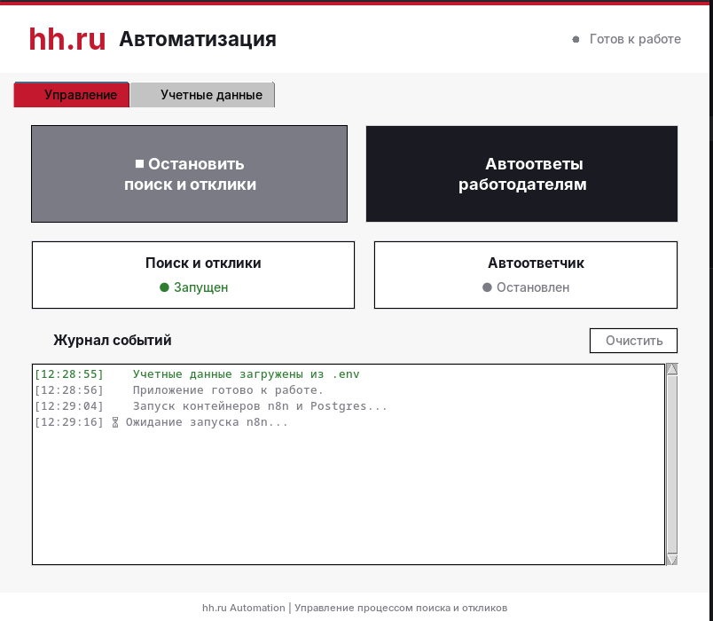

<div align="center">
  
# 🤖 HH.ru Automation Panel

### Seamless Integration between HH.ru and n8n Workflow Automation

<br>


<br>



</div>


---

## 🎯 Overview

The **HH.ru Automation Panel** provides a seamless bridge between **HH.ru** (HeadHunter) job platform and **n8n** workflow automation engine. This desktop application enables automated job searching, candidate tracking, and recruitment process automation through an intuitive graphical interface.

Built with Python and Tkinter, this tool orchestrates Docker containers running n8n workflows while managing authentication and data synchronization with HH.ru API.

---

## ✨ Features

- 🔐 **Automated Authentication** - Browser-based HH.ru cookie management
- 🐳 **Docker Integration** - Automatic n8n container orchestration
- ⚡ **Real-time Workflow Control** - Start/stop automation workflows
- 📊 **Visual Status Monitoring** - Live system viewport
- 🔧 **Zero Configuration** - Automatic .env and config file generation
- 🛡️ **Graceful Shutdown** - Clean Docker container termination

---

## 📦 Prerequisites

### Required Software

| Software | Version | Verification Command |
|----------|---------|---------------------|
| **Python** | 3.8+ | `python --version` |
| **Docker** | 20.10+ | `docker --version` |
| **Docker Compose** | 2.0+ | `docker compose version` |
| **Git** | Latest | `git --version` |

### System Dependencies

#### 🐧 Ubuntu / Debian
```bash
sudo apt update && sudo apt install python3-tk python3-dev
```

#### 🪶 Fedora / RHEL / CentOS
```bash
sudo dnf install python3-tkinter python3-devel
```

#### 🏹 Arch Linux / Manjaro
```bash
sudo pacman -S tk
```

---

## 🚀 Installation

### 1. Clone the Repository

```bash
git clone https://github.com/yourusername/hhru-automation-panel.git
cd hhru-automation-panel
```

### 2. Create Virtual Environment (Recommended)

```bash
python -m venv venv
source venv/bin/activate  # On Windows: venv\Scripts\activate
```

### 3. Install Python Dependencies

```bash
pip install -r requirements.txt
```

### 4. Start Docker Service

```bash
sudo systemctl start docker  # Linux
# Or start Docker Desktop on Windows/Mac
```

---

## ⚙️ Configuration

The application automatically generates configuration files on first run:

### Generated Files

| File | Purpose | Auto-generated |
|------|---------|----------------|
| `hh_cookies.json` | Stores HH.ru authentication cookies | ✅ After browser auth |
| `.env` | Contains n8n runner authentication token | ✅ On first launch |
| `docker-compose.yml` | n8n container configuration | ✅ On demand |

### Environment Variables

The `.env` file will contain:

```env
N8N_RUNNERS_AUTH_TOKEN=<automatically-generated-token>
N8N_PORT=5678
N8N_PROTOCOL=http
N8N_HOST=localhost
OPENROUTER_API_KEY=<you-need-to-put>
```

---

## 🎮 Usage

### Starting the Application

```bash
python app.py
```

### Application Workflow

1. **Launch the panel** - GUI window opens with system status
2. **Browser Authentication** - Automatically opens HH.ru login page
3. **Cookie Capture** - Credentials are securely saved to `hh_cookies.json`
4. **Docker Container Setup** - n8n containers are pulled and started
5. **Workflow Execution** - n8n workflows begin processing HH.ru data
6. **Real-time Monitoring** - View logs and status in the application window

### Interactive Controls

- 🟢 **Start Automation** - Begin workflow execution
- 🔴 **Stop Automation** - Gracefully stop running workflows
- 🔄 **Refresh Status** - Update connection status
- 📋 **View Logs** - Access detailed execution logs

---

## 🛑 Stopping the Application

### Automatic Cleanup

Simply **close the application window**. The system will automatically:

- ✅ Terminate all running n8n workflows
- ✅ Stop Docker containers
- ✅ Clean up temporary files
- ✅ Release network resources

### Manual Force Stop

If needed, manually stop containers:

```bash
docker compose down
```

---

## 💻 System Requirements

### Minimum Specifications

| Component | Requirement |
|-----------|-------------|
| **CPU** | 2 cores |
| **RAM** | 4 GB (8 GB recommended) |
| **Storage** | 2 GB free space |
| **Network** | Stable internet connection |
| **OS** | Windows 10+, macOS 11+, Linux (any modern distro) |

### Supported Browsers for Auth

- ✅ Google Chrome
- ✅ Mozilla Firefox
- ✅ Microsoft Edge

---

## 🔒 Security Notes

- 🔐 HH.ru cookies are stored locally in `hh_cookies.json`
- 🔑 Authentication tokens are generated per session
- 🛡️ No credentials are transmitted to external servers
- 📦 Docker containers run in isolated environment
- 🧹 All temporary data is cleaned on shutdown

---

## 🤝 Contributing

Contributions are welcome! Please follow these steps:

1. Fork the repository
2. Create a feature branch (`git checkout -b feature/AmazingFeature`)
3. Commit changes (`git commit -m 'Add AmazingFeature'`)
4. Push to branch (`git push origin feature/AmazingFeature`)
5. Open a Pull Request

---

## 📄 License

This project is licensed under the MIT License - see the [LICENSE](LICENSE) file for details.

---

## 🙏 Acknowledgments

- [HH.ru](https://hh.ru) - Job platform API
- [n8n](https://n8n.io) - Workflow automation engine
- [Python Tkinter](https://docs.python.org/3/library/tkinter.html) - GUI framework
- [Docker](https://docker.com) - Containerization platform